# Отчет по работе 1
### Задание 1
	*Исполняемый файл (исполняемый код) — файл, содержащий программу в виде набора элементарных инструкций, которая после
	загрузки в память может быть выполнена на определенном физическом устройстве (процессоре) под управлением опредленной операционной системы.
	*Языки низкого уровня - языки на которых можно непосредственно написать программу, исполняемую на физическом устройстве
	*Ассемблер — язык программирования низкого уровня, в котором каждая инструкция физического устройства представлена в текстовом виде
	*Исходный код - Программа написанная на языке высокого уровня
	*Виртуальная машина — это средство описания семантики языка программирования
	*Стандарт языка программирования — документ, описывающий язык программирования максимально подробно и, по возможности, наиболее формально
	*Транслятор — техническое средство, осуществляющее перевод текста программы с одного языка на другой
	*Компилятор - транслятор, переводящий программу в машинный код для последующего исполнения
	*Псевдокомпилятор — транслятор, переводящий программу в промежуточное представление (байт-код), который состоит из набора
	инструкций близких по смыслу к машинному коду
	*Компилирующий интрепретатор — транслятор, переводящий текст программы во внутреннем представление непосредственно после запуска
	*REPL-интерпретатор - программное средство, работающее в цикле чтения-вычисления-печати
	*Единица трансляции — минимальный фрагмент программы,который может быть транслирован независимо от остального кода
	*Предобработка - выполнение замен в тексте программ по заданным правилам.
	*Синтаксический анализ и генерация кода - проверка синтаксиса и генерация объектного кода или внутреннего представления программы.
	*Сборка (связывание) - объединение отдельных модулей (единиц трансляции) и внешних библиотек в исполняемую программу.
	*Загрузка -загрузка программы в память для последующего исполнения.
	*Ошибки с поздним обнаружением - ошибки, возникающие при выполнении программы
	*Ошибки времени выполнения (run time error) — ошибки использования виртуальной машины языка программирования, обнаруживаемые в
	момент их возникновения, например, деление на ноль или выход за границы массива.
	*Непредсказуемое поведение — в результате неверного использования виртуальной машины языка программирования дальнейшее исполнение
	программы может приводить к непредсказуемым ошибкам.
	*Неопределенное поведение — поведение программы однозначно, но не определено описанием языка. 
	*Препроцессинг (предобработка) — начальный этап трансляции программы
	*Сборка — заключительный этап трансляции, результатом которого является исполняемый файл
	*Объектный файл - результат трансляции модуля, который является переходным от текста программы к исполняемому файлу.
### Задание 2
	*F2 - сохранение файла
	*F3 - просмотр содержимого файла 
	*F4 - редактирование
	*F5 - копирование
	*F6 - переименование
	*F7 - создание папки
	*F8 - удаление
	*Alt + F1 - выбор диска (левая панель)
	*Alt + F2 - выбор диска (правая панель)
	*Shift + F4 - создание файла
	*Ctrl + o - скрыть панель для работы с командной строкой
### Задание 3
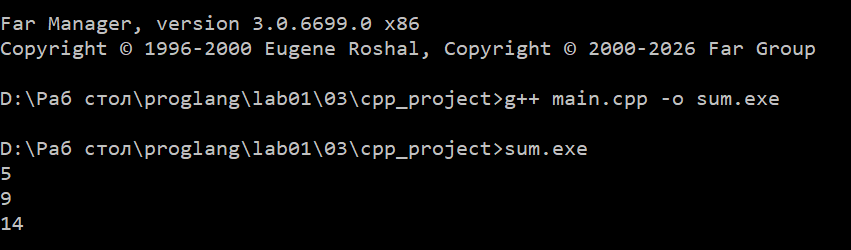

### Задание 4
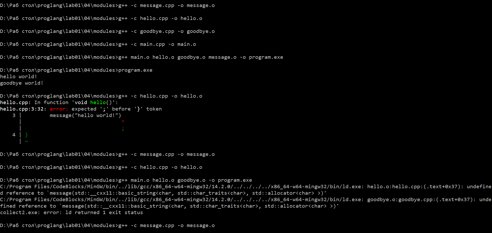

### Задание 5
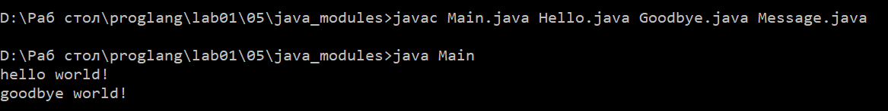

### Задание 6
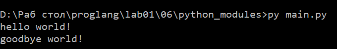

### Задание 7
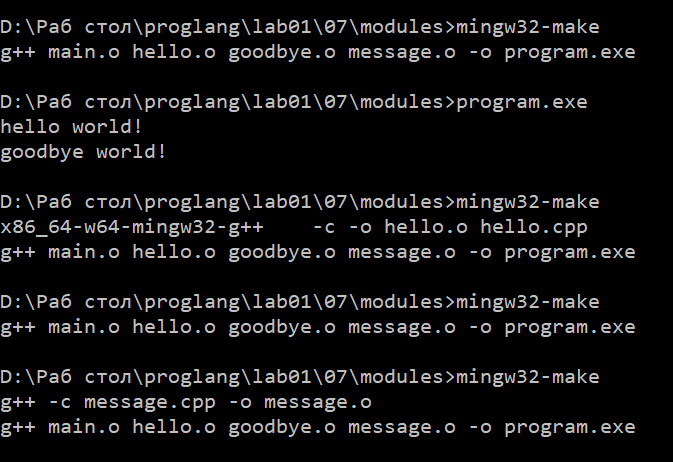
Пояснения по работе make:
Make - это утилита, которая управляет сборкой, анализируя временные метки файлов. В файле Makefile описаны цели, зависимости и команды для сборки.
Если целевой файл отсутствует или его дата изменения старше, чем у файлов-зависимостей, make выполняет соответствующую команду.
Если цель актуальна, то команда не выполняется.

### Задание 8
 	*Пункт 1. Использование вектора
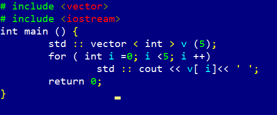
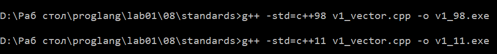

	*Пункт 2. Цикл по коллекции
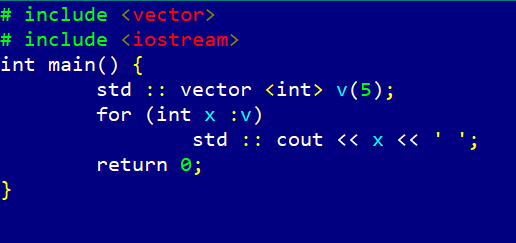
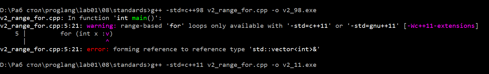

	*Пункт 3. Ключевое слово auto
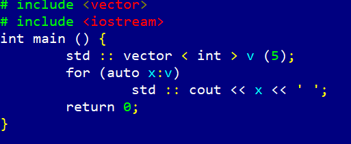
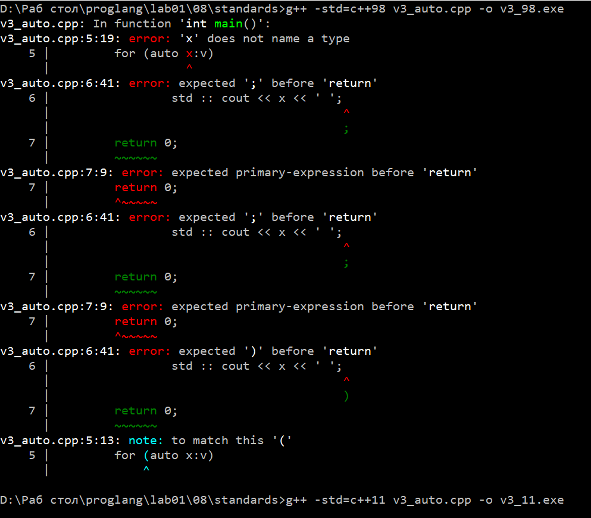

	*Пункт 4. Инициализация списком
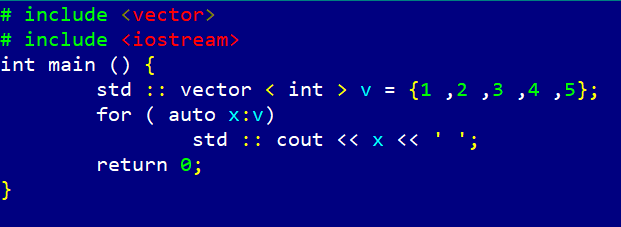
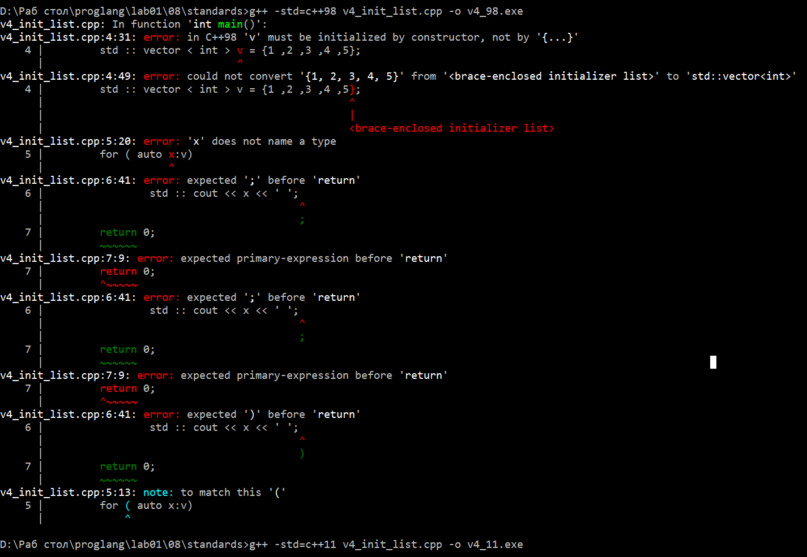

	*Пункт 5. Двоичные литералы
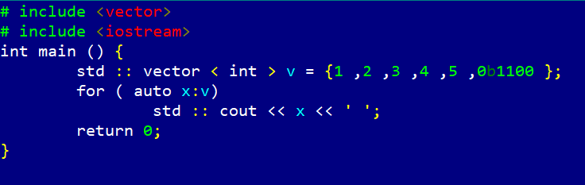
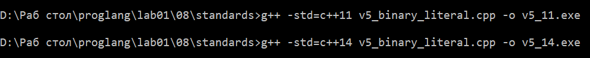

	*Пункт 6. Определение типа по конструктору
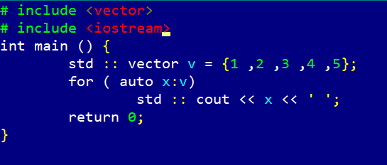
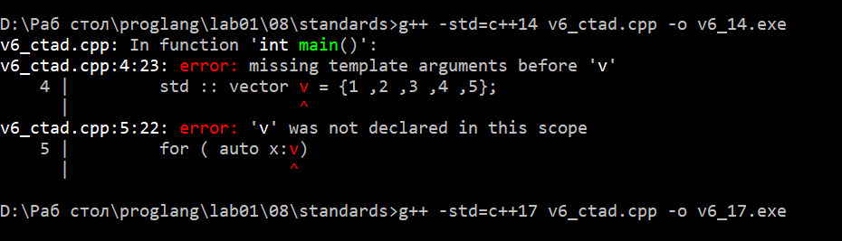
