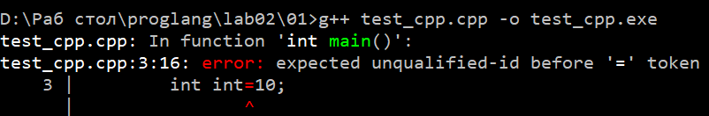
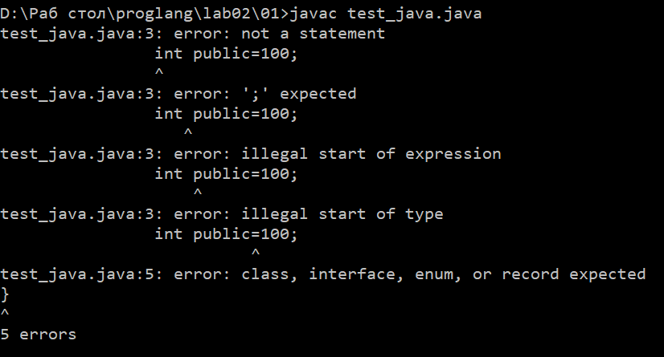
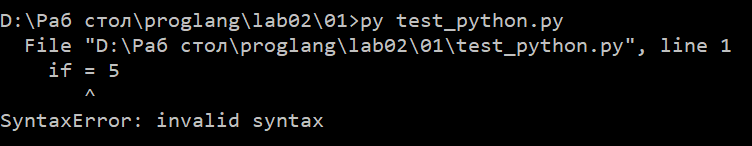
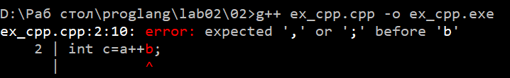
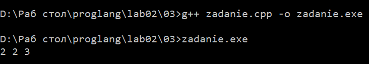

# Отчет по работе 2
### Задание 1
Ключевые слова:

	*C++: int, if, while, for, return;
	*Java: public, static, void, new, class;
	*Python: else, elif, break, continue, import.
Резульат проверки: Во всех трех языках нельзя использовать ключевые слова в качестве имен, иначе это вызывает ошибку компиляции или ситанксическую ошибку.

### Задание 2
Последовательность токенов (с++): int, a, =, 1, ",", b, =, 2, ";", int, c, =, a, ++, b, ";".
Последовательность токенов (py): a, =, 1, b, =, 2, c, =, a, +, +, b.

Объяснение ошибки: В с++ при компиляции "++" - это единый токен, который является унарным оператором, который возвращает значение.
После него компилятор ожидает увидеть конец(;), а не идентификатор, что приводит к синтаксической ошибке.
А в python отсутсвует оператор "++", поэтому компилятор разделяет на два токена, где первый "+" - оператор сложения, а второй "+" просто возвращает значение.

### Задание 3
Разбиение на токены: int, a, =, 1, ",", b, =, 2, ";", int, c, =, a, ++, +, b, ";".

Объяснение работы: компилятор разбивает а+++b как а++ + b по правилу максимального совпадения. 
Получается, что что а++ сначала возвращает старое значение а и потом увеличивает на 1. После этого вычисляется а+b и присваивается с.

Если разделить пробелом, то токены поменяются:

	1)Если написать а + ++b, то b будет увеличиваться на 1 и потом складываться с а;
	2)Если написать а + + +b, то b долно остаться преждним и просто суммироваться с а.

### Задание 4
() и [] являются операторами, когда вычисляют какие-либо значение. () - это оператор вызова функции или группировки. [] - это оператор индексации.
Примеры:

	* res=sum(a,b); - оператор функции
	* int d=(a+b)/c; - оператор группировки
Такие скобки НЕ являются операторами, когда обозначают границы блоков кода, список параметров и тд, то есть служат знаками пунктуации.
Примеры:

	* int sum(int a, int b){return a+b} - синтаксис объявления функции, здесь () - это просто рамка для списка параметров.
	* if (a>b){...} - здесь () обязательный элемент синтаксиса if.

### Задание 5
Ключевые слова: for, in

Идентификаторы, задающие переменные: i

Идентификаторы, задающие имена функций: print, map, sum, zip, input, int

Идентификаторы, задающие имена методов: split

Литералы: 1,2,3

Операторы:'*' (распаковка), '.'(оступ к атрибуту), ()(вызов), .

Вызываемые функции:
1) input() - без параметров
2) str.split() - без параметров
3) int(x)- строка
4) map(func, iterable) - функция и итератор
5) zip(*iterables) - несколько итераторов
6) sum(iterable) - итератор числа
7) print(*args) - распакованные аргументы

Принцип работы:
Программа считывает 3 строки по 3 числа в каждой. С помощью map(int, input().split()) строки преобразуются в список.
Далее zip группирует элементы по столбцам, map(sum, ...) суммирует элементы каждого столбца, print выводит полученные суммы

### Задание 6
Виды комментариев в С++:

*однострочные: //текст

*многострочные: /*текст*/

	*Пример 1: cout<<"Hello /*Это комментарий*/world"; 
Работает верно, но это не комментарий, а часть текста строки

	*Пример 2: // /*
	Это комментарий
	*/
Работает неверно, "//" - знак однострочного комментария, но после него идет знак, который не является началом блочного комментария, а по сути является часть самого текста 

	*Пример 3: /* Я комментирую программы /* комментарий */ */
Выдаст ошибку, потому что в С++ нет вложенных комментариев

	*Пример 4: // Я комментирую программы /* комментарий */
Сработает правильно, потому что строка начинается с // и все следующее после него до конца строки - это сам комментраий, а знаки просто игнорируются

	*Пример 5: /* Я комментирую свои программы
	// Это комментарий до конца строки */
	*/
Вызовет ошибку, потому что комментрарий открывается /*, находится закрывающий занк в конце второй строки, а третья строка остается вне комментария, что 
является синтаксической ошибкой

### Задание 7 
Как видно из правил, есть 3 инструкции циклов.

Первый вид - цикл while, который соответсвует строке правила: while ( condition ) statement

Форма записи (по правилу): клучевое слово while, в круглых скобках условие condition, далее инструкция statement

Пример программы:

	*int x = 1;
	while (x <1000) {
	cout << x;
	x *= 2;
	}

Второй вид - цикл do-while, который соответсвует строке правила: do statement while ( expression ) ;

Форма записи (по правилу): ключевое слово do, далее инструкция statement, затем ключевое слово while, в круглых скобках выражение expression

Пример программы:

	*int x=1;
	do{
		cout<<x;
		x*=2;
	}
	while(x<1000);

Третий вид - цикл for, который соответствует строке правила: for ( init-statement conditionopt ; expressionopt ) statement

Форма записи (по правилу): клучевое слово for, в круглых скобках инструкция инициализации init-statement, необязательное выражение expressionopt, далее инструкция statement

Пример работы:

	*for (int x=1; x<1000; x*=2){
	cout<<x;	
	}

 