### Отчет по лабораторной работе №3

## Задание 1 (3)
Составьте глоссарий из определений лекции. Проверка отчета будет включать проверку знания определений

* Тип в программировании — атрибут объекта данных, задающий множество допустимых значений и методы для работы с ними
* Статическая типизация - набор правил, которым обладает язык программирования, если тип объекта данных определяется в момент трансляции
* Динамическая типизация - набор правил, которым обладет язык программирования, если тип объекта данных определяется на этапе выполнения программы в момент создания или присваивания значения
* Неявная типизация - подход в языках программирования, при котором компилятор или интерпретатор сам определяет тип переменной на основе значения, которое ей присваивается
* Явное преобразование типа - преобразование, которое указано в программе в виде вызова функции или в виде операции
* Неявное преобразование типа - преобразование, которое не присутствует в программе в виде конкретного указания, однако транслятор сам подставляет требуемый метод преобразования
* Сильная типизация — язык программирования не содержит (почти не содержит) правил неявного преобразования типа 
* Слабая типизация — язык программирования содержит большое число правил неявного преобразования типа, допускает каламбуры типизации

## Задание 2 (3)
Запишите правила неявного преобразования типов в языке С++. Проверка отчета будет включать проверку знания правил.

Преобразования при присваивании:

* При присваивании значение правого операнда приводится к типу левого операнда
* При вызове функции фактический параметр приводится к типу формального параметра 

Преобразования при арифметических действиях:

* Если длины обоих типов меньше int то преобразование к int.
* Если типы разной длины, то преобразуется меньший к большему
* Если типы равной длины и один знаковый, а другой беззнаковый, то знаковый приводится к беззнаковому.
* Если один целый, а другой вещественный, то целый приводится к вещественному 

Преобразования с логическими значениями:

* Результат условного выражения в инструкциях ветвления и цикла приводится к логическому типу.
* Если оператор требует целого числа то операнд приводится к целому (суффиксный инкремент, декремент, сдвиги, остатки от деления, битовые операции).
* Если оператор требует логического значения, то операнды приводятся к логическому типу (логические операции)

## Задание 3 (2)
Языки C++ и Java имеют похожий синтаксис, однако язык С++ относят к языкам со слабой статической типизацией, а Java - с сильной статической типизацией. Приведите примеры, показывающие это различие. Для этого вам надо подобрать несколько близких по смыслу фрагментов программ, которые будут транслироваться в С++, но вызывать ошибку согласования типов в Java.
Записанные программы сохраните в папке с номером задания. В отчет запишите пояснения к работе программ.

В обеих программах сначала объявляется программа типа double, после этого объявляется переменная типа int, которой присваивается значение первой переменной.
В С++ компилятор автоматически выполняет неявное преобразование типов, то есть просто отбрасывается дробная часть. Программа успешно компилируется и запускается.
В Java компилятор строго следит за типами данных, поэтому если не использовать явное приведение типов, то происходит ошибка компиляции.

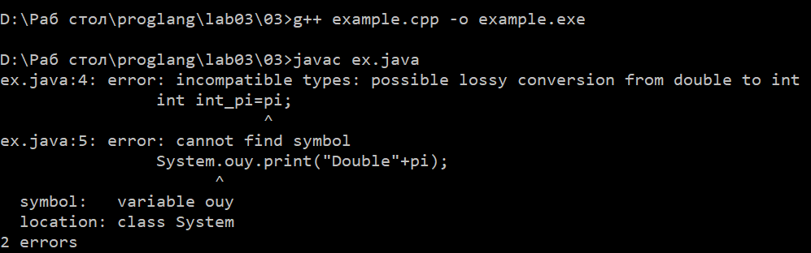 

## Задание 4 (1)
Рассмотрите следующий фрагмент программы.

bool x = true, y = false;
auto z = x + y;
std::cout << typeid(z).name() << std::endl;
auto a = x & y;
std::cout << typeid(a).name() << std::endl;
auto b = x && y;
std::cout << typeid(b).name() << std::endl;
Используя typeid, найдите типы переменных a и b. Объясните результат.
Записанную программу сохраните в папке с номером задания.

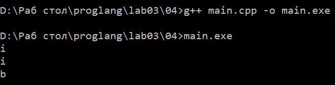
1) z=x+y это арифметическая операция, в С++ при выполнении таких действий применяется правила целочисленного продвижения, то есть true=1, false=0, в итоге резульатом операции является int.
2) a=x&y это побитовая операция, работает также как и в случае с арифметической операцией и возвращает тип int
3) b=x&&y это логическая операция, которая работает с пременными типа bool, всегда возвращает тип bool.
auto в данном случае позволяет компилятору самостоятельно приводить типы данных.

## Задание 5 (2)
Приведите разумные (логичные) примеры использования в С++ ключевых слов typedef, auto, decltype, static_cast и оператора sizeof.
Записанные программы сохраните в папке с номером задания. В отчет запишите пояснения к программам.

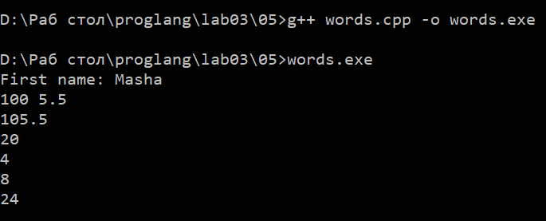
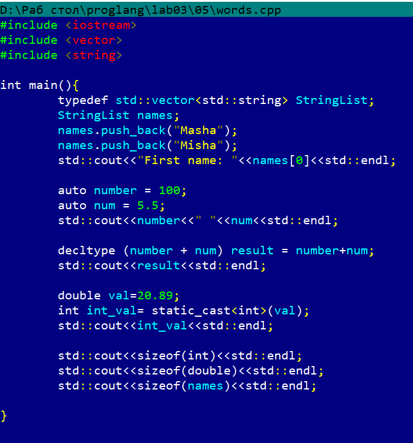

Пояснение к программе:

* typedef позволяет заменить длинное имя на короткое, что делает код более понятным и визульно чистым, а также делает написание программы более удобным и быстрым.
* auto фвтоматически определяет тип данных
* decltype определил, что резульатом стложения int и double является double, поэтому дробная часть сохранилась.
* static_cast<int> отбросил дробную часть
* sizeof показал размер типов в байтах: int - 4, double - 8, vector - 24 (независимо от количества элементов в нем)

## Задание 6 (2)
Рассмотрите следующий фрагмент программы.
int a = -1, b = 1;
unsigned int c = 1;
std::cout << a*b << std::endl;
std::cout << a*c << std::endl;
Объясните работу этой программы, используя правила неявного преобразования типов
Что произойдет, если тип int заменить на short, а unsigned int на unsigned short?*

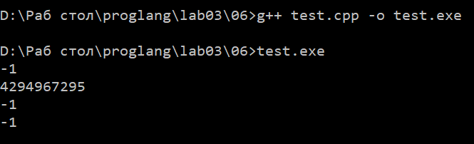
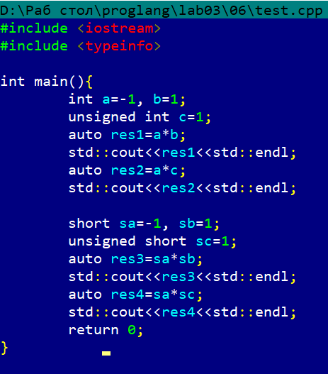

Объяснение:
* В первом варианте программы при умножении a на b происходит действие с операндами одного типа и никаких преобразований не требуется. При умножении a на с происходит операция с знаковой и беззнаковой операндами, таким образомзнаковый неявно преобразуется в беззнаковый, то есть а=-1 преобразуется в unsigned int. Получается, что отрицательное число превратилось в большое положительное.
* Во втором варианте программы при умножении sa на sb типы, размер которых меньше int при выполнении арифметических операций увеличиваются до int. При умножении sa на sc сначала обе операнды повышаются до int, после чего происходит операция с двумя знаковыми int, поэтому преобразования не происходит.

## Задание 7 (2)
Рассмотрите следующий фрагмент программы.
int x = 7, y = 4;
long double d = 0.25;
cout << (x / y) / d << endl;
cout << (x / d) / y << endl;
long a = 200000, b = 200000;
long long c = 200000;
std::cout << (a * b) * c << std::endl;
std::cout << a * (b * c) << std::endl;
Почему изменения порядка действий приводит к изменению результата? Объясните работу этой программы, используя правила неявного преобразования типов

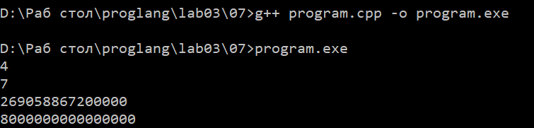
Объяснение работы программы:

* (x / y) / d сначала выполняется целочисленное деление в скобках (остаток отбрасывается), потом по правилам арифметических преобразований, int неявно преобразуется в long double, после чего уже вычисляется итоговое значение, которое имеет тип long double
* (x / d) / y сначала дейсвтие в скобках с неявным преобразованием, после чего левый операнд long double, а правый int, тогда опять происходит неявное преобразование int в long double

Вывод: изменение порядка приводит к разному результату, потому что в первом случае сначала происходит целочисленное деление, а во втором сразу c участием long doble

* (a * b) * c обе операнды long, происходит переполнение, поэтому число становится отрицательным, после чего происходит неявное преобразование левого операнда в long long, как итог огромное отрицательное число
* a * (b * c) сначала происходит неявное преобразование b в скобках в long long, далее опять преобразование в long long

Вывод: изменение порядка действий может привести к переполнению

## Задание 8 (2)
Для каких значений целочисленных переменных x, y ,z результатом вычисления следующего выражения будет истина? Перечислите все случаи. Объясните работу этой программы, используя правила неявного преобразования типов
(x == y) + (x == z) == true

Объяснение  программы: оператор == возвращает bool, при арифметическом сложении + тип bool неявно преобразуется в int.
Программа вычисляется слева направо с учетом приоритетов, снчала скобки (это bool), затем выполняется сложение с неявным преобразованием (сумма может быть 1,2,0), затем резульат суммы сравнивается с true, которое в свою очередь также неявно преобразуется в 1.
Получается выражение будет истинно, когда сумма будет 1. Это возможно в двух случаях:
	1) х==у истинно и x==z ложно, то есть х=у, но х!=z
	2) x==y ложно и x==z истинно, то есть x!=y, но x==z

## Задание 9 (2)
Проверьте работу логического выражения
x==y==z
в языках Python, Java, C++ для целочисленных переменных x, y, z. Объясните результат для каждого из языков.
Записанную программу сохраните в папке с номером задания.

В Python работают цепочные сравнения, то есть сначала сравниваются х и у, а потом у и z. В программе проверяется, что все три переменные равны друг другу.
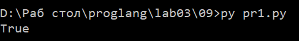

В Java нет цепочных сравнений, то есть сначала сравняться х и у, а потом должно произойти сравнение это скобки с z, но boolean и int нельзя сравнивать, потому что это строго типизированный язык, из-за чего выводится ошибка
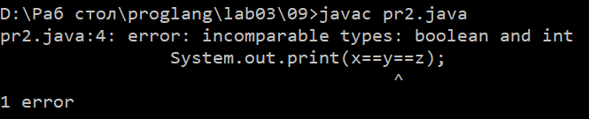
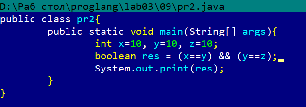

В С++ также нет цепочных сравнений, но есть неявное преобразование. Получается, он сравнивает результат первого сравнения bool с третьим числом, поэтому из-за неявного преобразования резульат не всегда может быть коррекртным.
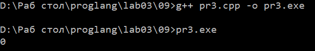

## Задание 10 (1))
Напишите программу на Python , демонстрирующую возможность неявного преобразования строки в логическое значение.
Записанную программу сохраните в папке с номером задания.
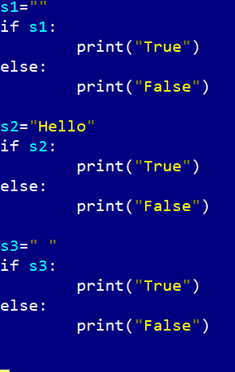
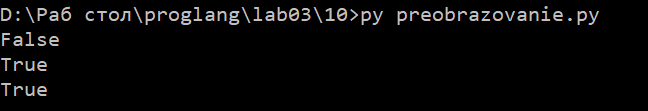

В Python любое значение может использоваться в логическом контексте, то есть неявное преобразование к типу bool
Получается можно не писать if len(s)>0 для проверки строки на пустоту, можно просто написать if s. Пустая строка - False, любая другая - True. Это неявное преобразование str в bool.

